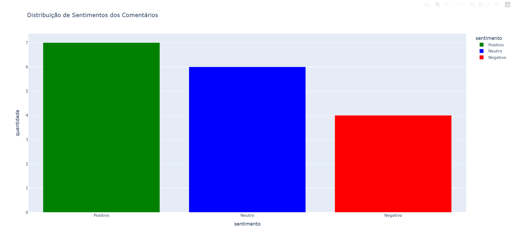
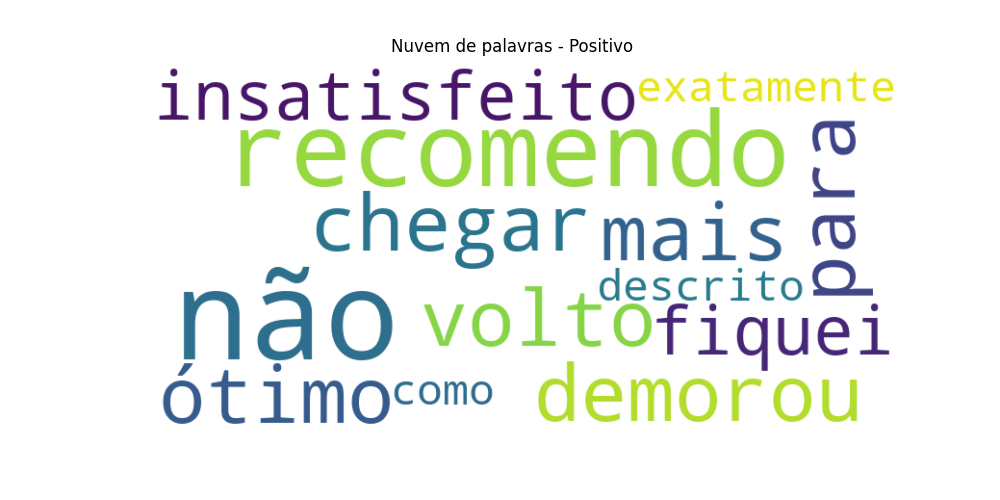
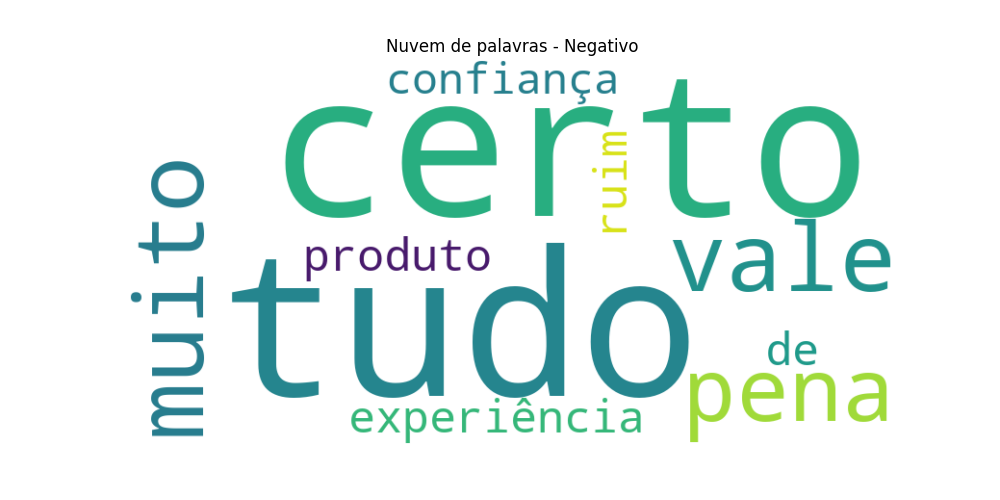
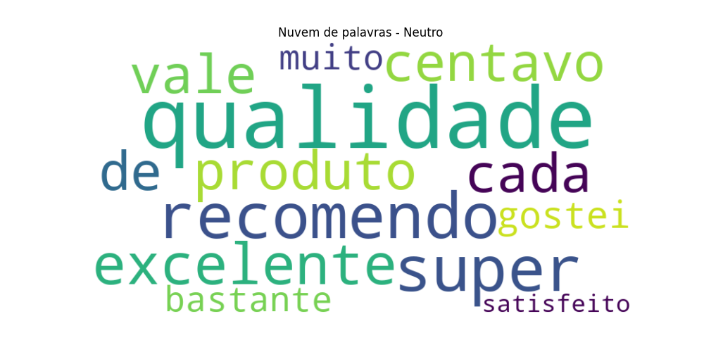

# Analisador de Sentimentos de Comentários

Projeto que classifica comentários em **Positivo, Negativo ou Neutro** usando **Machine Learning (Naive Bayes)** e gera visualizações interativas para análise rápida dos dados.

## Visualização do Dashboard


## WordClouds





## Funcionalidades

- Classificação automática de sentimentos em comentários.  
- Dashboard interativo mostrando a distribuição dos sentimentos.  
- WordClouds por categoria de sentimento, destacando palavras mais frequentes.  
- Salvamento automático de gráficos e WordClouds para apresentação.

## Tecnologias

- Python  
- Pandas  
- Scikit-learn  
- Plotly  
- WordCloud + Matplotlib  

## Como Rodar

1. Instale Python 3.x.  
2. Instale as dependências:  
```bash
pip install pandas scikit-learn plotly wordcloud matplotlib
